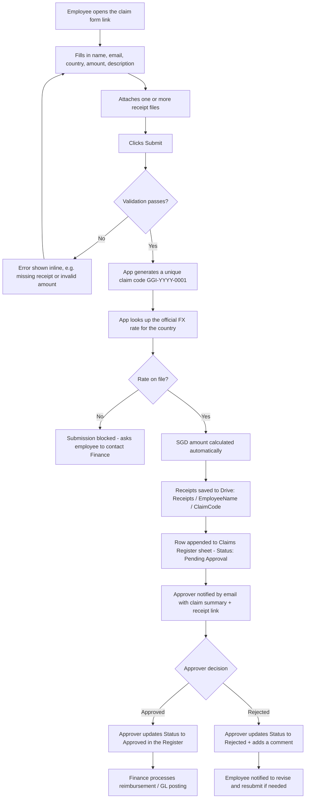

# Expense Claim Submission Flow

## Overview

## Step-by-step

1. **Employee opens the form** (bookmarked web app link, shared once at rollout).
2. **Fills in the claim**: full name, work email, country (currency
   auto-fills), amount in local currency, and a short purpose/description.
3. **Attaches receipts** — multiple files can be selected in one go
   (PDF, JPG, PNG).
4. **Submits.** The app validates everything client- and server-side
   (required fields, positive amount, at least one receipt, file size
   limits) before doing anything else.
5. **Claim code is generated**: sequential and unique, e.g. `GGI-2026-0001`.
   This is the reference number used in all future correspondence.
6. **Currency conversion**: the app looks up the country's local
   currency → SGD rate from the Finance-maintained *GGI FX Rates
   Reference* sheet. Employees never type the SGD amount themselves —
   it's always calculated from the rate on file, so there's no risk of
   miscalculation or manual overstatement. If no rate is on file for
   that country, submission is blocked with a clear message rather than
   guessing.
7. **Receipts are filed automatically**: a folder is created (or reused)
   per employee under `Receipts/`, and a claim-specific subfolder is
   created inside it (`GGI-2026-0001 - 2026-08-17`) so receipts never mix
   between claims or people.
8. **Audit record is written**: one row is appended to the
   `GGI Expense Claims Register` sheet with the timestamp, claim code,
   employee, country, local amount, FX rate + source + date, SGD amount,
   description, and a link to the receipt folder. Status starts as
   `Pending Approval`.
9. **Approver is notified** by email immediately, with the claim summary
   and a direct link to the receipts.
10. **Approval**: the approver reviews the receipts and updates the
    `Status`, `Approver`, `Approval Date`, and `Approver Comments`
    columns directly in the Register — no separate approval screen to
    build or maintain.
11. **Reimbursement**: Finance filters the Register for `Approved` claims
    to process payment / post to the general ledger, then can mark them
    `Paid` (add this as an extra status value if useful).

## Compliance notes

- **Segregation of duties** — employees can only create claims; only
  people with edit access to the Register can approve them. Restrict
  Register edit access to Finance/approvers (Drive → Share →
  set employee visibility to "Viewer" or don't share the raw sheet at
  all, since employees never need to open it).
- **Audit trail** — every claim is an immutable, timestamped row; the
  underlying receipt files are never overwritten (each claim gets its
  own dated subfolder).
- **Currency transparency** — the FX rate, its source, and the date it
  was set are stored alongside every claim, so any SGD figure can be
  traced back to the exact rate used.
- **No self-approval** — approvers should not approve their own claims;
  route those to a second approver manually.
- **Retention** — keep the Register and Receipts folder for your
  organization's required retention period (commonly 5–7 years for
  expense/tax records — confirm with Finance/legal) before archiving.
- **Access control** — the web app is restricted to your Google
  Workspace domain (`access: DOMAIN` in the manifest), so it isn't
  reachable by anyone outside the organization.
