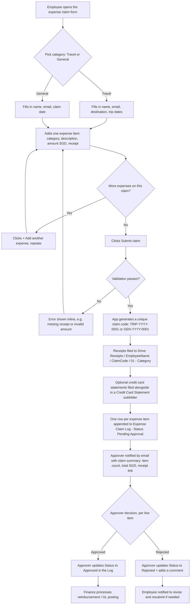

# Expense Claim Submission Flow

## Overview

## Step-by-step

1. **Employee opens the form** (bookmarked web app link, shared once at
   rollout).
2. **Picks a claim category**: **Travel** or **General**. This decides
   which header fields appear next and which subcategory list each
   expense item's dropdown offers.
3. **Fills in the header once**: full name and work email always; for
   **Travel**, also destination and the trip's start/end dates; for
   **General**, a single claim date.
4. **Adds one or more expense items** for the claim. Each item needs a
   category (Transport/Food/Entertainment/Misc for Travel;
   Training/Fixed Asset/Entertainment/Meal/Transport/Medical/
   Miscellaneous for General), a short description, the amount in SGD,
   and at least one receipt file (PDF/JPG/PNG). If the expense was paid
   on a company credit card, the employee can also attach the credit
   card statement/slip as corroborating proof — optional, but
   recommended for card charges.
5. **Submits.** Everything is validated client- and server-side before
   anything is written: required header fields for the chosen category,
   a valid date range (Travel only), a positive amount and at least one
   receipt per item, and file size limits.
6. **Claim code is generated**: sequential and unique, prefixed by
   category — e.g. `TRIP-2026-0001` for Travel or `GEN-2026-0001` for
   General. Travel and General numbering run independently, so neither
   category's sequence affects the other's. This code is the reference
   number for all of that claim's receipts.
7. **Receipts are filed automatically**: a folder is created (or
   reused) per employee, a claim folder inside it named with the claim
   code plus destination/dates (Travel) or "General" plus the claim
   date (General), and a numbered subfolder per expense item (e.g.
   `01 - Transport`) so receipts from different items or claims never
   mix. Optional credit card statements go in a `Credit Card Statement`
   subfolder alongside that item's receipt.
8. **Audit record is written**: one row per expense item is appended to
   the `GGI Expense Claim Log` sheet, all sharing the same claim code,
   category, employee, and destination/dates or claim date, plus that
   item's subcategory, description, SGD amount, and links to its
   receipt/statement files. Status starts as `Pending Approval`.
9. **Approver is notified** by email immediately with a claim-level
   summary (category, item count, total SGD) and a link to the
   receipts.
10. **Approval**: the approver reviews each line item and updates its
    `Status`, `Approver`, `Approval Date`, and `Approver Comments`
    directly in the Log — no separate approval screen to build or
    maintain. Approval is per line item, so one questionable item
    doesn't have to hold up the rest of the claim.
11. **Reimbursement**: Finance filters the Log for `Approved` rows,
    grouping by Claim Code where useful, to process payment / post to
    the general ledger.

## Compliance notes

- **Segregation of duties** — employees can only create entries; only
  people with edit access to the Log can approve them. Restrict Log
  edit access to Finance/approvers.
- **Audit trail** — every expense item is an immutable, timestamped
  row; receipt files are never overwritten (each item gets its own
  numbered subfolder).
- **Corroborating evidence** — the optional credit card statement
  attachment lets approvers cross-check the claimed amount against the
  actual card charge without needing a separate reconciliation process.
- **No self-approval** — approvers should not approve their own claims;
  route those to a second approver manually.
- **Retention** — keep the Log and Receipts folder for your
  organization's required retention period (commonly 5–7 years for
  expense/tax records — confirm with Finance/legal).
- **Access control** — the web app is restricted to your Google
  Workspace domain (`access: DOMAIN` in the manifest).
