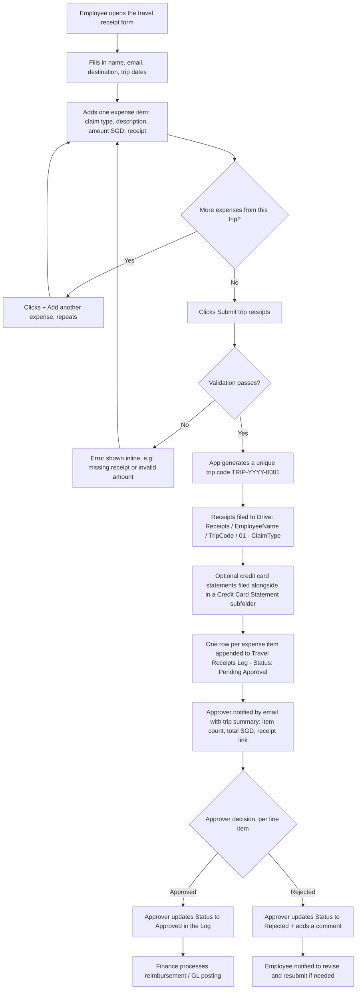

# Travel Receipt Submission Flow

## Overview

## Step-by-step

1. **Employee opens the form** (bookmarked web app link, shared once at
   rollout).
2. **Fills in the trip header once**: full name, work email,
   destination, and the trip's start/end dates.
3. **Adds one or more expense items** for the trip. Each item needs a
   claim type (Transport, Food, Entertainment, or Misc), a short
   description, the amount in SGD, and at least one receipt file
   (PDF/JPG/PNG). If the expense was paid on a company credit card, the
   employee can also attach the credit card statement/slip as
   corroborating proof — optional, but recommended for card charges.
4. **Submits.** Everything is validated client- and server-side before
   anything is written: required fields, a valid date range, a positive
   amount and at least one receipt per item, and file size limits.
5. **Trip code is generated**: sequential and unique, e.g.
   `TRIP-2026-0001`. This is the reference number for all of that
   trip's receipts.
6. **Receipts are filed automatically**: a folder is created (or
   reused) per employee, a trip folder inside it named with the trip
   code/destination/dates, and a numbered subfolder per expense item
   (e.g. `01 - Transport`) so receipts from different items or trips
   never mix. Optional credit card statements go in a `Credit Card
   Statement` subfolder alongside that item's receipt.
7. **Audit record is written**: one row per expense item is appended to
   the `GGI Travel Receipts Log` sheet, all sharing the same trip code,
   employee, destination, and dates, plus that item's claim type,
   description, SGD amount, and links to its receipt/statement files.
   Status starts as `Pending Approval`.
8. **Approver is notified** by email immediately with a trip-level
   summary (item count, total SGD) and a link to the receipts.
9. **Approval**: the approver reviews each line item and updates its
   `Status`, `Approver`, `Approval Date`, and `Approver Comments`
   directly in the Log — no separate approval screen to build or
   maintain. Approval is per line item, so one questionable item
   doesn't have to hold up the rest of the trip.
10. **Reimbursement**: Finance filters the Log for `Approved` rows,
    grouping by Trip ID where useful, to process payment / post to the
    general ledger.

## Compliance notes

- **Segregation of duties** — employees can only create entries; only
  people with edit access to the Log can approve them. Restrict Log
  edit access to Finance/approvers.
- **Audit trail** — every expense item is an immutable, timestamped
  row; receipt files are never overwritten (each item gets its own
  numbered subfolder).
- **Corroborating evidence** — the optional credit card statement
  attachment lets approvers cross-check the claimed amount against the
  actual card charge without needing a separate reconciliation process.
- **No self-approval** — approvers should not approve their own trips;
  route those to a second approver manually.
- **Retention** — keep the Log and Receipts folder for your
  organization's required retention period (commonly 5–7 years for
  expense/tax records — confirm with Finance/legal).
- **Access control** — the web app is restricted to your Google
  Workspace domain (`access: DOMAIN` in the manifest).
